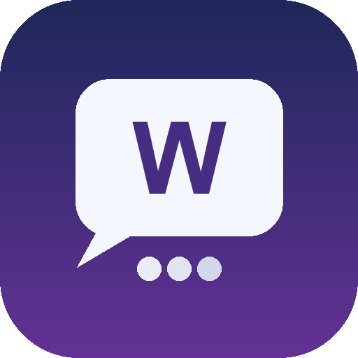

<div align="center">
  
  <h1>WeAuto</h1>
  <p>基于 macOS / Windows 原生窗口的微信 GUI 自动化与 AI 助手。</p>
  <p><strong>不 Hook、不注入、不读取微信数据库。</strong></p>
</div>

## 项目概览

WeAuto 通过系统原生窗口捕获、OCR / Vision 和输入操作处理独立微信聊天窗口，在本地完成
消息检测、上下文维护、LLM 回复和工具调用。macOS 使用 Quartz / AppleScript，Windows 使用
Win32 窗口 API；两端共用消息、Agent、记忆、桥接、Web 控制台和 Bot 守护逻辑。

### 主要能力

- **macOS + Windows**：macOS 菜单栏 App 与 Windows 系统托盘提供一致的控制能力
- **Detached Window 接收**：逐个捕获独立聊天窗口，避免依赖微信内部接口
- **OCR + Vision 双解析**：本地 OCR 为基础，可启用视觉模型解析消息结构并自动回退
- **多阶段 LLM**：独立的 decision、reply、planner、summary、heartbeat 配置
- **Agent 工具系统**：记忆、聊天记录检索、网页搜索、天气、Python、图片生成与编辑
- **长期记忆与人物印象**：按会话保存历史，维护摘要、核心记忆和联系人印象
- **外部处理桥接**：支持 HTTP / OpenClaw 短桥接，以及持久 WebSocket 长桥接
- **运行控制与观测**：菜单栏 / 系统托盘启停与重启，Web UI 查看状态、会话与实时日志

## 快速开始

### 1. 前置条件

- macOS 12 或更高版本，或 Windows 10/11 64 位
- Python 3.12
- [uv](https://docs.astral.sh/uv/)（Windows 可执行 `winget install --id=astral-sh.uv -e`）
- 微信桌面版已登录
- macOS：为 WeAuto（或终端 / Python）授予辅助功能和屏幕录制权限
- Windows：在已登录且未锁屏的交互式桌面会话运行，WeAuto 与微信使用相同权限级别

### 2. 创建配置

macOS：`cp config.toml.example config.toml`；Windows：
`Copy-Item config.toml.example config.toml`。启动脚本也会在缺失时自动创建。

至少配置 `[llm]` 的服务地址、API key 和模型。首次运行建议保留：

```toml
dry_run = true
```

### 3. 准备聊天窗口

把需要处理的微信会话拖出主窗口，使其成为独立的 detached window。当前正式支持的
接收模式为：

```toml
receiver_mode = "detached_windows"
```

### 4. 首次启动

macOS：`./start_app.sh`

Windows：`powershell -ExecutionPolicy Bypass -File .\start_app.ps1`，也可以双击
`start_app.cmd`。

脚本使用 UV 托管的 Python 3.12 创建 `.venv312`、同步对应平台依赖、安装 Playwright
Chromium，并启动菜单栏或系统托盘控制面板。
确认检测和日志正常后，再把 `dry_run` 改为 `false`。

### 5. 日常启动

首次初始化完成后，macOS 双击 **`WeAuto.app`**；Windows 双击 **`WeAuto.vbs`**
可隐藏启动并在系统托盘运行。

- macOS 运行状态显示在菜单栏，Windows 运行状态显示在系统托盘
- Web 控制台默认地址：<http://127.0.0.1:8721>
- `.app` 依赖项目内的代码和虚拟环境，不要把本体移出仓库；可创建替身或固定到 Dock

## 启动方式

| 场景 | 命令 / 入口 |
|---|---|
| macOS 日常使用 | 双击 `WeAuto.app` |
| Windows 日常使用 | 双击 `WeAuto.vbs` |
| macOS 控制面板 + Bot | `./start_app.sh` |
| Windows 控制面板 + Bot | `.\start_app.ps1` 或双击 `start_app.cmd` |
| 无状态栏/托盘运行 | `start_app.sh --headless` / `.\start_app.ps1 --headless` |
| 仅面板，不自动启动 Bot | `start_app.sh --no-bot` / `.\start_app.ps1 --no-bot` |
| 直接调试 Bot | `start_rpa.sh config.toml` / `.\start_rpa.ps1 config.toml` |
| macOS 定期重启守护 | `./start_rpa_watchdog.sh config.toml` |

## 处理模式

`processing_mode` 决定消息由谁生成回复：

| 模式 | 说明 |
|---|---|
| `native` | 使用 WeAuto 本地的 LLM、记忆和 Agent 工具链 |
| `bridge` | 将标准化事件发送给 HTTP 或 OpenClaw，再由 WeAuto 负责发送 |
| `long_bridge` | 通过持久 WebSocket 连接远程 OpenClaw channel |

长桥接插件说明见
[openclaw-weauto-channel/README.md](openclaw-weauto-channel/README.md)。

## 项目结构

```text
WeAuto.app/                 macOS 应用包与共享图标
WeAuto.vbs                  Windows 隐藏启动入口
app/                        菜单栏/系统托盘、Web UI、Bot supervisor
wechat_rpa/                 接收、解析、决策、工具与发送核心
openclaw-weauto-channel/    OpenClaw 持久 channel 插件
data/
  chat_history/             按会话、日期保存的聊天记录
  config/                   人格、用户、工具和别名配置
  memory/                   核心记忆与时间线
  people/                   人物印象
  skills/                   本地技能
docs/                       配置、运行、排障与架构文档
tests/                      核心行为测试
archive/legacy/             已归档的旧接收模式和历史实现
```

## 文档

- [文档总览](docs/README.md)
- [系统总览](docs/01-system-overview.md)
- [安装与首次运行](docs/02-installation-and-first-run.md)
- [配置指南](docs/03-configuration.md)
- [运行方式与控制面板](docs/04-running-and-control-panel.md)
- [消息接收与回复流程](docs/05-message-processing.md)
- [Agent、记忆、人物与技能](docs/06-agent-memory-and-tools.md)
- [桥接与外部集成](docs/07-bridges-and-integrations.md)
- [数据、日志与维护](docs/08-data-and-maintenance.md)
- [架构与代码地图](docs/09-architecture-and-code-map.md)
- [开发与测试](docs/10-development-and-testing.md)
- [故障排查](docs/11-troubleshooting.md)

## 使用边界

WeAuto 依赖屏幕内容、窗口布局和 GUI 自动化。微信版本、显示缩放、窗口尺寸或系统权限
变化都可能影响识别与发送。新环境务必先使用 `dry_run = true` 验证，并仅在你有权处理
的会话和设备上运行。
